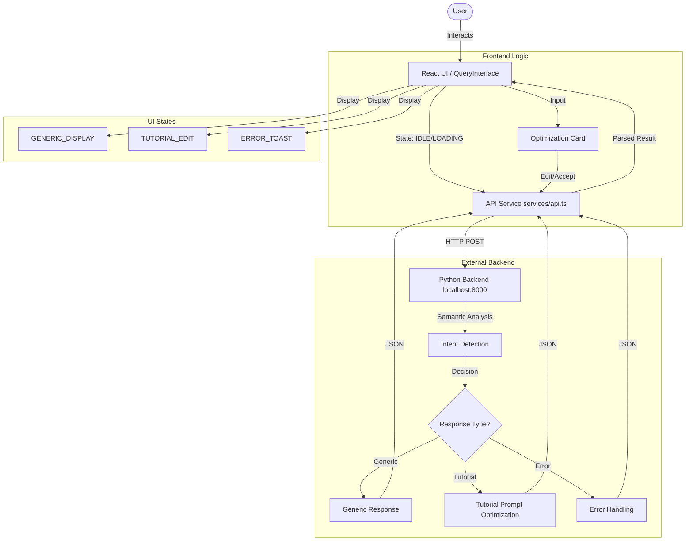

# Architecture

This document outlines the high-level architecture of the Text2Block application, visually demonstrating the flow of data between the user interface, the API service, and the external Python backend.

## System Diagram

## Explanation

The architecture is built around a clear separation of concerns between the frontend state management and the backend semantic analysis.

### 1. Frontend (React + TypeScript)
-   **QueryInterface**: The main entry point for user interaction. It functions as a state machine managing transitions between `IDLE`, `LOADING`, `GENERIC`, `TUTORIAL`, and `ERROR` states.
-   **API Service (`services/api.ts`)**: accessible via a centralized service that abstracts the HTTP communication. It handles:
    -   **Data Mapping**: converting Supabase profile objects into the format expected by the backend.
    -   **Response parsing**: Standardizing the diverse responses from the backend into strict types (`DISPLAY_MODE`, `EDIT_MODE`, `ERROR`).
    -   **Mock Mode**: A built-in simulation layer for testing without a live backend.

### 2. Backend (Supabase + External Python)
-   **Supabase**: Handles user authentication and persistent profile storage (`profiles` table).
-   **Python Backend**: A separate service (running on `localhost:8000` or production URL) responsible for:
    -   **Intent Detection**: Determining if a query is a simple question or a request for learning material.
    -   **Prompt Optimization**: If a tutorial is requested, it enriches the user's raw query with context from their profile (education, experience) to generate a high-quality prompt for the LLM.

### 3. Data Flow
1.  **User Query**: The user submits a query via the Dashboard.
2.  **Optimization**: The `optimizePrompt` function sends the query and user profile to the backend.
3.  **Decision**: The backend decides if the response should be a direct answer (Generic) or an interactive optimization session (Tutorial).
4.  **Interaction**:
    -   **Generic**: The answer is displayed immediately.
    -   **Tutorial**: The user is presented with a "Refined Request" card, allowing them to edit the AI-optimized prompt before generating the final content.
